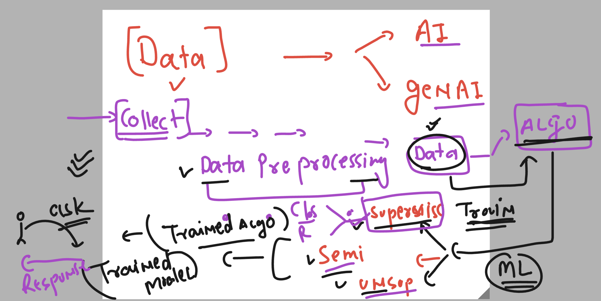
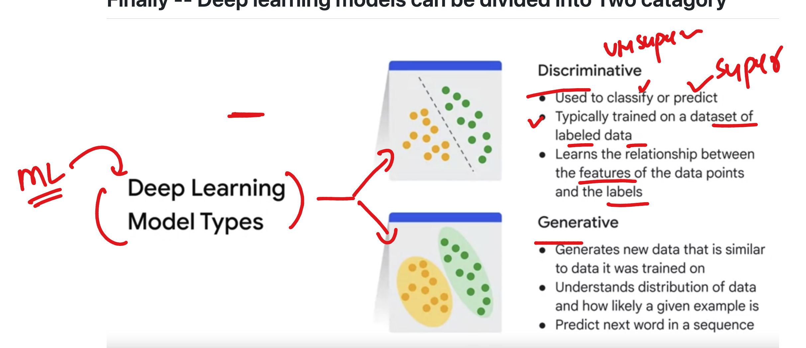
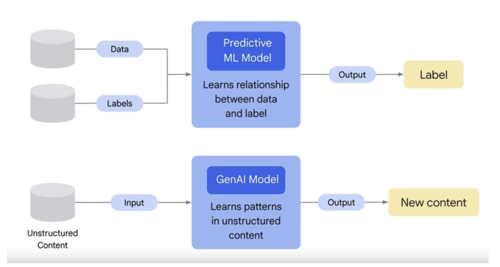
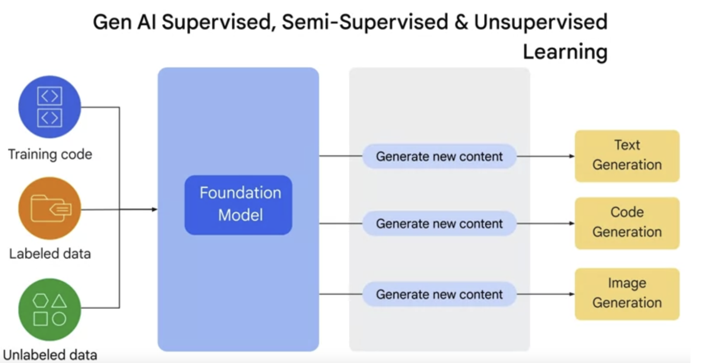
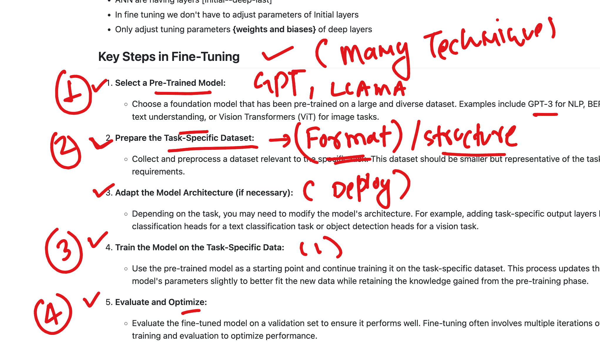
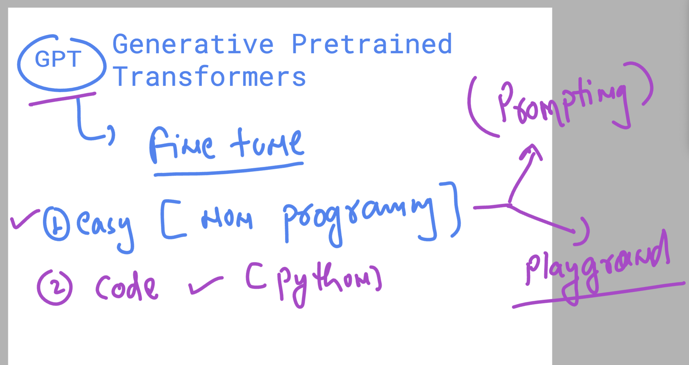
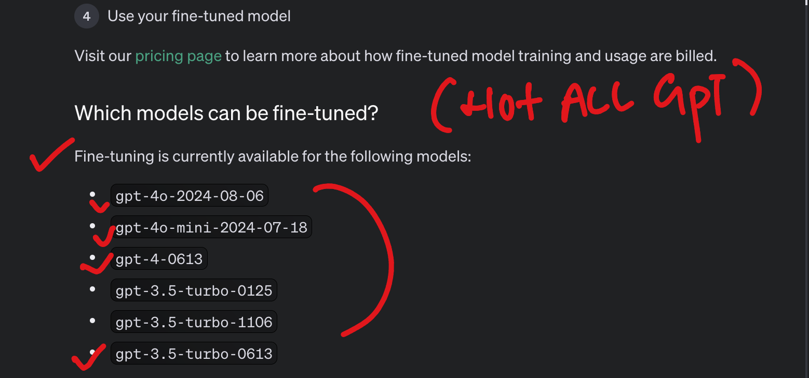
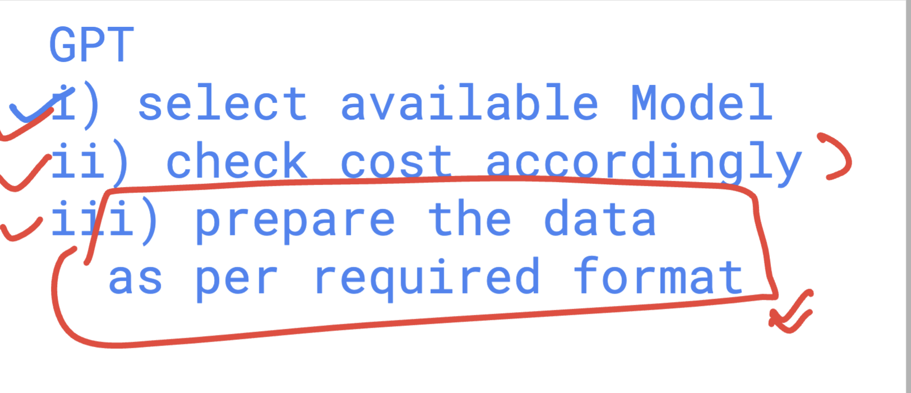
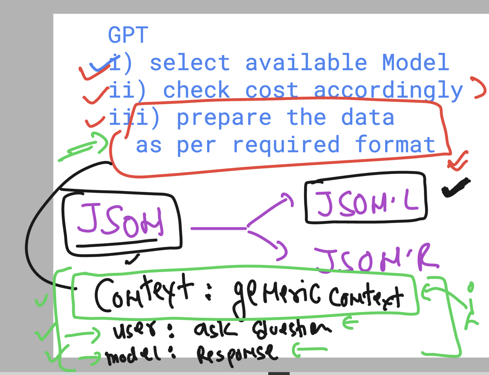
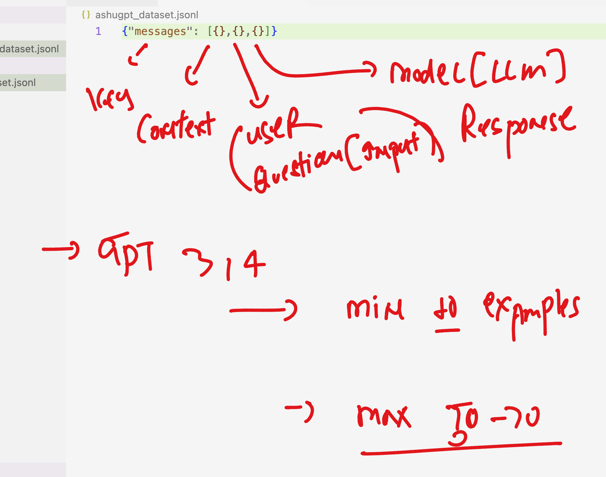

### Revising the ML model Training 

### Discriminative vs Generative 

### GenAI vs Discriminative models

### data generation by GENAI image 

### Foundation models things 

### for Fine tuning the steps involed 

### GPT fine tuning 

### Not all GPT models are available for fine tuning 

### GPT overall 

### GPT fine tuning data format 

### GPT data format 

