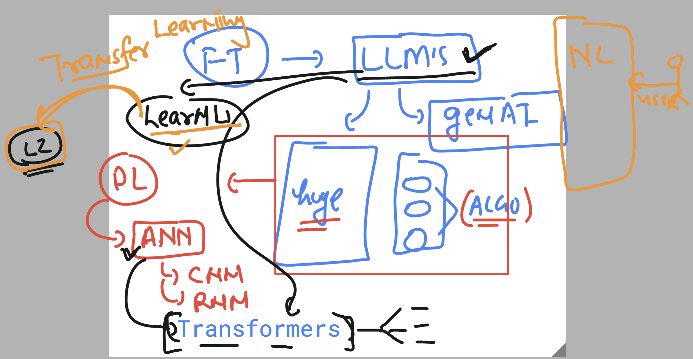

## Revision 
### info about LLM internals 



### bit more info 


### Understanding Hyper paramter 


### creating python virtual environment for avoiding libs conflicts issues

```
ashu@ip-172-31-79-44:~/mycodes$ 
ashu@ip-172-31-79-44:~/mycodes$ python3  -m venv  ashu-env 
ashu@ip-172-31-79-44:~/mycodes$ ls
ashu-env  query.py
ashu@ip-172-31-79-44:~/mycodes$ source  ashu-env/bin/activate
(ashu-env) ashu@ip-172-31-79-44:~/mycodes$ 


```
