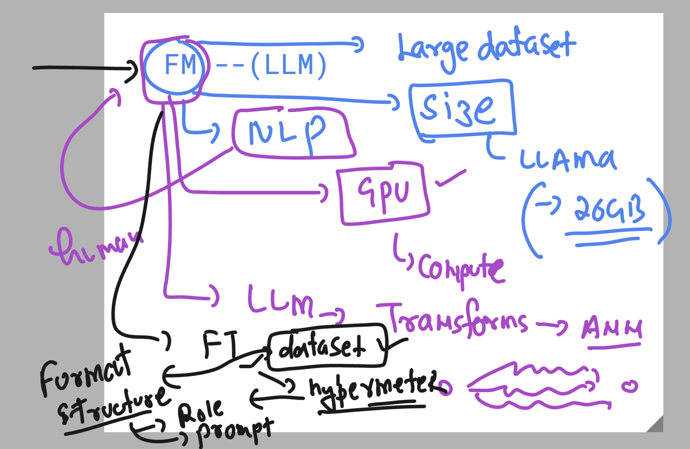
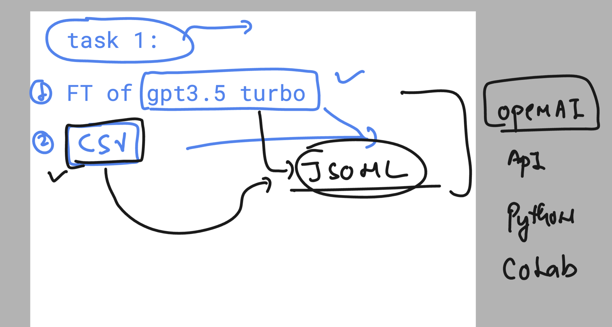
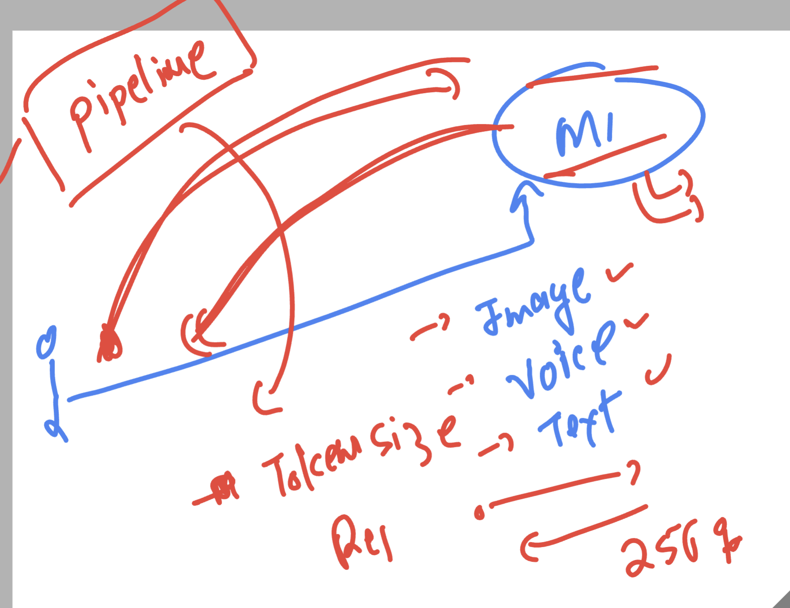

## Revision 

## task 

### Fine tune gpt3.5 turbo 

### download dataset 

[click_to_view](https://raw.githubusercontent.com/redashu/Datasets/refs/heads/master/hotel_hospitality_data.csv)

### read about Unsloth 

[click](https://docs.unsloth.ai/)

## Importantces of pipeline of hugging face transformers 

## access link to HG pipelines 

[click_here](https://huggingface.co/docs/transformers/en/main_classes/pipelines)

## More info about Parameter in fine tuning of LLM

# Types of Parameters in Fine-Tuning

**3 types of parameters we have**
- Hyperparameters
- Model parameters
- Specific Fine-Tuning Techniques Parameters

## Hyperparameters

### Learning Rate
- **Description:** Controls the step size at each iteration while moving toward a minimum of the loss function.
- **Impact:** Affects the convergence speed and stability of the training process.

### Batch Size
- **Description:** The number of training examples used in one iteration.
- **Impact:** Influences the training time and stability of the gradient estimation.

### Epochs
- **Description:** The number of complete passes through the entire training dataset.
- **Impact:** Determines how long the model trains and can affect overfitting or underfitting.

### Dropout Rate
- **Description:** The fraction of neurons to drop during training to prevent overfitting.
- **Impact:** Helps in regularizing the model by preventing co-adaptation of neurons.

### Weight Decay
- **Description:** A regularization technique that adds a penalty to the loss function based on the magnitude of model weights.
- **Impact:** Prevents overfitting by discouraging large weights.

### Learning Rate Scheduler
- **Description:** A strategy to adjust the learning rate during training.
- **Impact:** Helps in fine-tuning the learning process to achieve better convergence.

## Model Parameters

### Weights
- **Description:** Parameters that define the strength of connections between neurons in the network.
- **Impact:** Directly influence the output of the neural network.

### Biases
- **Description:** Parameters added to the weighted sum of inputs to the neurons.
- **Impact:** Allow the activation function to be shifted left or right, which can help in better fitting the data.

## Specific Fine-Tuning Techniques Parameters

### Layer-Specific Learning Rates
- **Description:** Different learning rates for different layers in the model.
- **Impact:** Allows more control over which parts of the model should adapt faster or slower.

### Adversarial Training Parameters
- **Description:** Parameters controlling the generation of adversarial examples (e.g., perturbation size).
- **Impact:** Influence the robustness of the model to adversarial attacks.

### Low-Rank Adaptation (LoRA) Parameters
- **Description:** Parameters for the additional low-rank matrices.
- **Impact:** Control the adaptation without changing the original weights significantly.

## Summary

Fine-tuning involves adjusting both hyperparameters and model parameters. Hyperparameters control the training process, including learning rate, batch size, epochs, dropout rate, weight decay, and learning rate scheduler. Model parameters, such as weights and biases, are the internal parameters that the model learns from the data. Specific fine-tuning techniques may introduce additional parameters to better control the adaptation process.

## More info about LLama 

# Fine-Tuning LLaMA 3: Open-Source Options

Fine-tuning large language models like LLaMA 3 involves leveraging various open-source frameworks, tools, and libraries. Below are the popular options categorized by frameworks, methods, and distributed training techniques.

---

## Frameworks and Libraries

### 1. Hugging Face Transformers
- **Method:** Use the `transformers` library with the `Trainer` or `Accelerate` for distributed fine-tuning.
- **Options:**
  - **Standard Fine-Tuning:** Fine-tune using the `Trainer` API.
  - **Low-Rank Adaptation (LoRA):** Efficient fine-tuning of large models by only training a subset of parameters.
  - **PEFT (Parameter-Efficient Fine-Tuning):** Includes LoRA, adapters, and prefix tuning.

### 2. DeepSpeed
- **Method:** Use DeepSpeed for high-performance distributed training with features like zero redundancy optimization (ZeRO).
- **Options:**
  - **DeepSpeed ZeRO:** Optimizes memory and computation for large-scale models.
  - **DeepSpeed LoRA:** Adds LoRA fine-tuning support.
  - **RLHF (Reinforcement Learning with Human Feedback):** Fine-tuning with human feedback via DeepSpeed integration.

### 3. PyTorch Lightning
- **Method:** Simplified training loops with native support for distributed training and mixed precision.
- **Options:**
  - Use LightningModules for model-specific fine-tuning.
  - Integrate with Hugging Face for seamless support.

### 4. OpenLLaMA (by OpenLM)
- **Method:** Fine-tuning with pre-built configurations specific to LLaMA models.
- **Options:**
  - LoRA support.
  - Foundation model support with custom datasets.

### 5. Colossal-AI
- **Method:** Large-scale model training optimization with minimal infrastructure.
- **Options:**
  - LoRA-based fine-tuning.
  - ZeroRedundancy and parallelization techniques.

### 6. Unsloth
- **Method:** Efficient fine-tuning of large language models with parameter-efficient strategies.
- **Options:**
  - Adapter-based fine-tuning.
  - Integration with various transformer architectures.

### 7. Alpaca/LLaMA-Adaptive
- **Method:** Fine-tuning using lightweight wrappers for specific large models like LLaMA.
- **Options:**
  - Simplified integration for task-specific fine-tuning.

---

## Fine-Tuning Methods

### 1. Full Fine-Tuning
- Involves updating all parameters of the model.
- Suitable for domain-specific or task-specific datasets.

### 2. Parameter-Efficient Fine-Tuning (PEFT)
- **LoRA:** Adds trainable low-rank matrices to layers.
- **Prefix Tuning:** Adds trainable prefix tokens to the input.
- **Adapters:** Adds small trainable layers to freeze pre-trained model parameters.

### 3. Quantization-Aware Fine-Tuning
- Reduces model size by applying quantization techniques like 8-bit or 4-bit precision training.

### 4. Instruction Tuning
- Fine-tuning with datasets in instruction-response format to align with user queries.

### 5. RLHF (Reinforcement Learning with Human Feedback)
- Fine-tuning models to align outputs based on human preference data.

---

## Distributed Training Options

### 1. FairScale
- Provides memory-saving techniques like sharded data parallelism.
- Useful for training models with limited GPU resources.

### 2. Ray Train
- Distributed training framework for managing fine-tuning workloads.

### 3. FSDP (Fully Sharded Data Parallel)
- PyTorch’s built-in library for memory-efficient distributed training.

### 4. Gradient Accumulation
- Useful for fine-tuning on single GPUs with smaller batch sizes.

---

## Cloud/Hosted Options

### 1. Hugging Face Hub
- Fine-tune using hosted environments and push trained models back to the hub.

### 2. Google Colab / Kaggle Notebooks
- Run experiments for small-scale fine-tuning.

### 3. AWS SageMaker
- Optimized infrastructure for fine-tuning large models.

### 4. Lambda Labs
- Offers cloud GPUs optimized for AI workloads.

---

By choosing one of these methods or frameworks based on your resources and goals, you can fine-tune LLaMA 3 effectively. For more details, refer to the official documentation of each framework.
