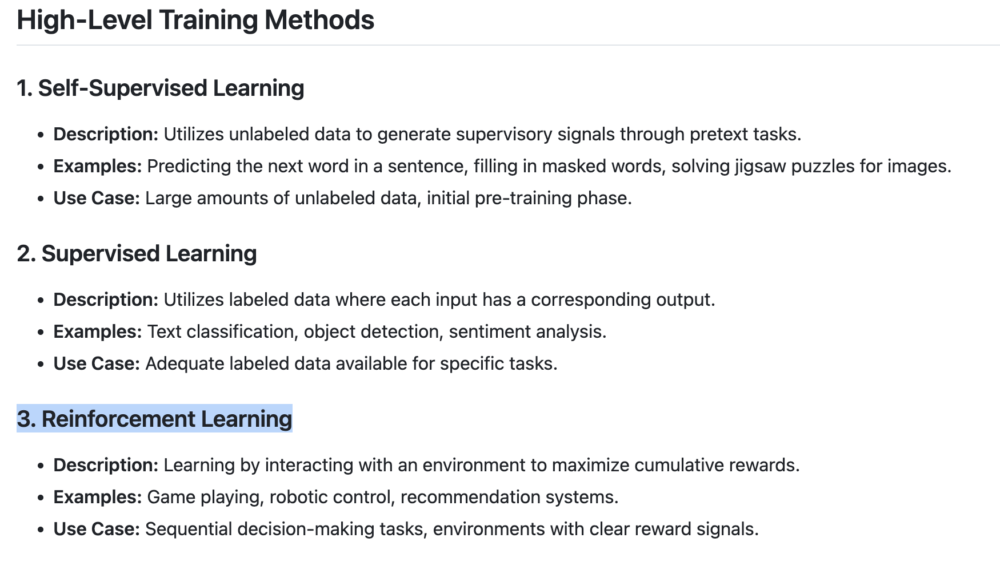

## More Fine tuning discussion 
### Traning methods for LLM 

### Fine tuning methods 

:-1 Full fine tuning 
:- 2 PEFT (Parameter Efficient Fine tuning)
      -->  LORA , QLORA

## Fine tuning llama model 

### link for docs

[read_here](https://www.llama.com/docs/getting_the_models/)

### data format of llama 3 for fine tuning purpose 

[read_more](https://www.llama.com/docs/model-cards-and-prompt-formats/llama3_1/)

### few things to note 

### few adjustment we can do

