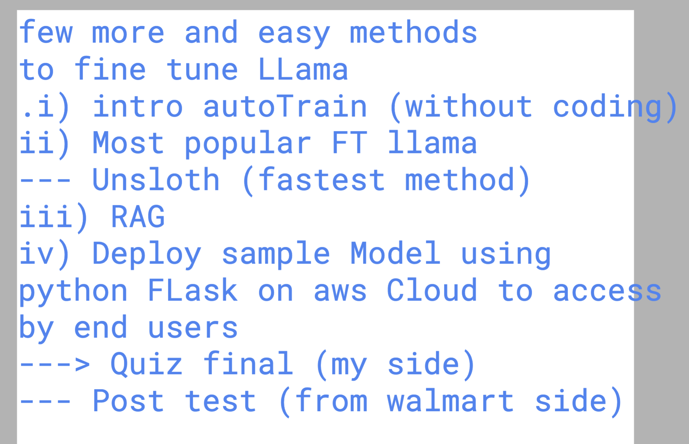

## Final day 



## using Venv in python 

```
stat@ip-172-31-79-44:~$ python3
Python 3.10.12 (main, Nov  6 2024, 20:22:13) [GCC 11.4.0] on linux
Type "help", "copyright", "credits" or "license" for more information.
>>> import openai
Traceback (most recent call last):
  File "<stdin>", line 1, in <module>
ModuleNotFoundError: No module named 'openai'
>>> 
stat@ip-172-31-79-44:~$ ls
mycodes
stat@ip-172-31-79-44:~$ cd mycodes/
stat@ip-172-31-79-44:~/mycodes$ ls
query.py  stat-env
stat@ip-172-31-79-44:~/mycodes$ source  stat-env/bin/activate
(stat-env) stat@ip-172-31-79-44:~/mycodes$ python3
Python 3.10.12 (main, Nov  6 2024, 20:22:13) [GCC 11.4.0] on linux
Type "help", "copyright", "credits" or "license" for more information.
>>> import openai
>>> 
(stat-env) stat@ip-172-31-79-44:~/mycodes$ 

```